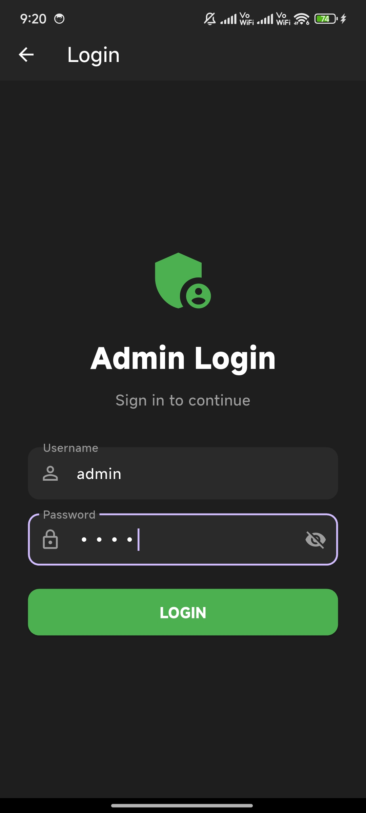
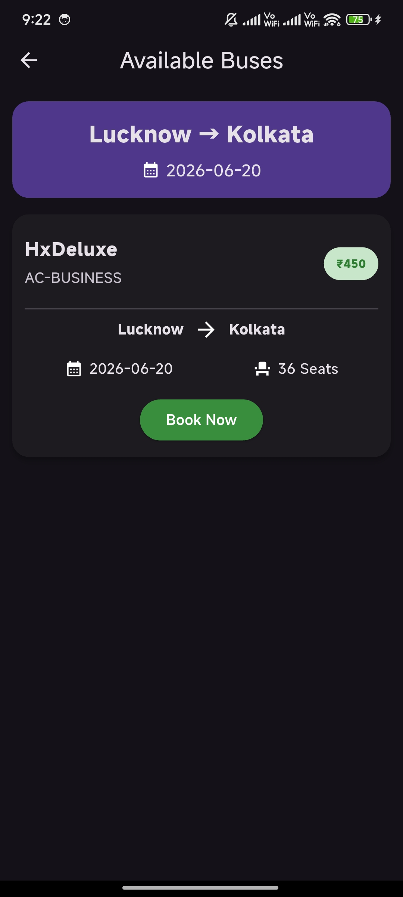
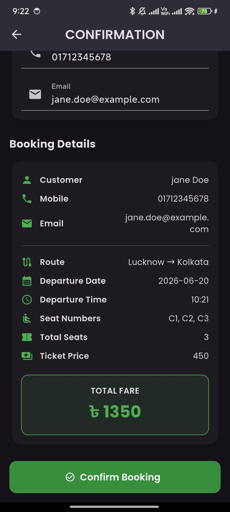
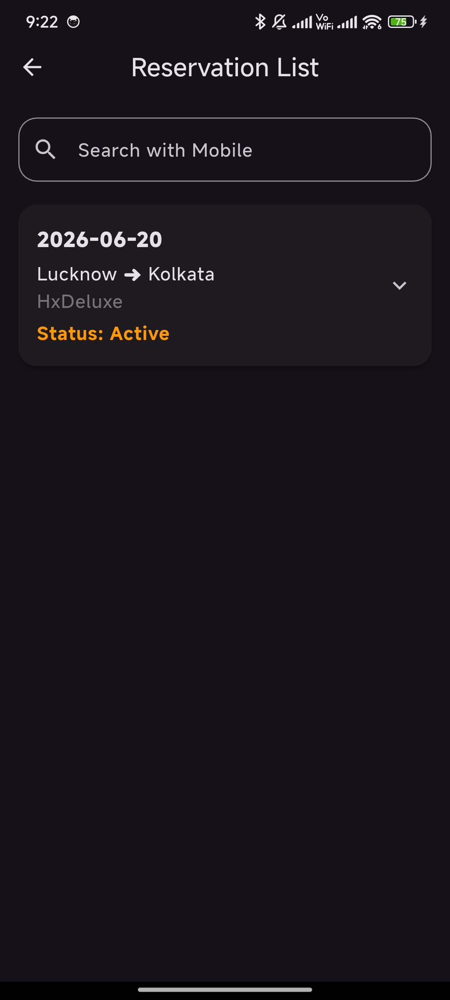
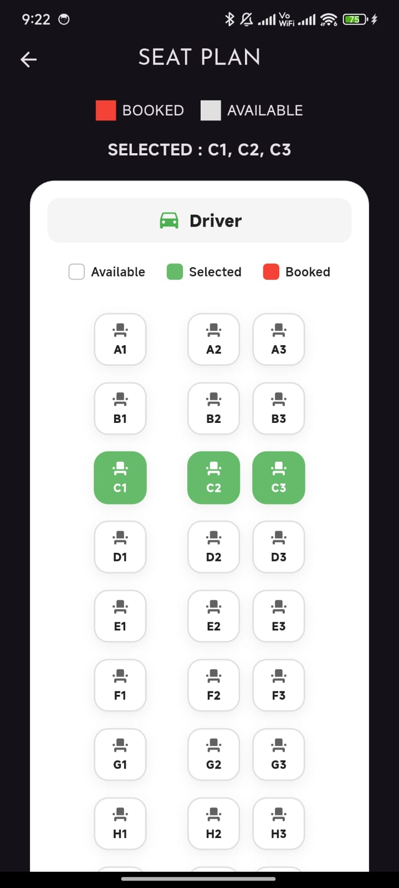

# Bus Reservation System

A full-stack bus reservation application built with Flutter and Spring Boot.

## Features

- User Authentication with JWT
- View Available Routes
- View Bus Schedules
- Make Reservations
- Search Reservations
- Admin Management for Buses, Routes and Schedules

## Tech Stack

### Frontend

- Flutter
- Provider
- Freezed
- HTTP

### Backend

- Spring Boot
- Spring Security
- JWT Authentication
- Hibernate / JPA
- MySQL

## Screenshots

| Admin Login | Available Buses | Booking Confirmation | Reservation Details | Seat Plan |
|-------------|-----------------|----------------------|---------------------|-----------|
|  |  |  |   |  |

## Getting Started

### Setting Up Backend

1. Configure MySQL
2. Update application.properties
3. Run Spring Boot application

### Setting Up Frontend

1. flutter pub get
2. flutter run

## Learning Outcomes

- REST API development
- JWT Authentication
- Spring Security
- Database integration with MySQL
- Flutter state management
- Full-stack mobile application development